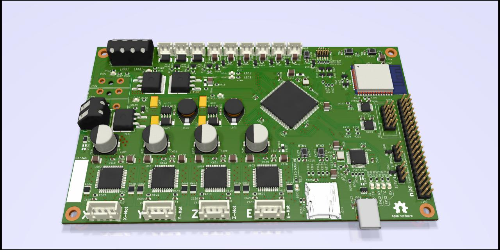

# FHNW-Pro4E-FS19T8-3DPrinterBoard-STM32

Marlin 2.0 compatible 3D printer board based on STM32F103.
Made for the Creality Ender 3 Pro mechanical frame.
Uses TMC2660 with StallGuard for sensorless homing on X and Y axis.

---

FHNW School of Engineering

Elektro- und Informationstechnik (EIT)

FS 2019 - Projekt 4 - Team 8

#### Abstract

> This report documents the development of a controller board and the adaptation of an open source firmware for a common hobbyist 3D printer. The innovative aspects of this hard- and software development are the usage of a 32-bit microcontroller as well as implementing a web interface for remote access. Part of the research included the incorporation of high-end stepper motor drivers, which detect a motor stall, thereby enabling a sensorless homing of the printer’s axes. A Creality Ender 3 Pro provided the mechanical elements of the printer hardware. The mainboard was built around an STM32F103 microcontroller with an ARM Cortex-M3 core.
TMC2660 drivers were used to drive the motors of the three axes (x, y, z) as well as the extruder. Furthermore, Wi-Fi compatibility was achieved by embedding an ESP32-WROOM-32 module on the mainboard. Every feature of the 3D printer, including the upload of G-code files, can be controlled through the ESP3D firmware, which provides a web interface. Since the main processor uses a 32-bit architecture, the development branch of the Marlin firmware 2.0 was used. Additionally, the newly implemented over-the-air update feature can be used to conveniently upload the latest version of the Marlin firmware to the microcontroller. The use of the stall detection feature of the TMC2660 motor drivers proved to be feasible in order to omit mechanical limit switches on the x- and y-axis. On the z-axis, however, the stall detection feature showed to be too unreliable. Finally, the Marlin 2.0 firmware is in a working state
and the use of 32-bit microcontrollers is recommended for future developments of 3D printer hardware.

#### Keywords
> 3D printer firmware, Wi-Fi web interface, sensorless homing, motor stall detection, over-the-air update, Ender 3 Pro, StallGuard

Based on the `stm32 stm32F103ZEt6`

---

## 💾 Marlin Firmware

Marlin 2.0 Software is in a separate repository.

[MuellerDominik/Marlin](https://github.com/MuellerDominik/Marlin)

---

## 📖 Documentation (German)

Documentation in German is in a seperate repository.

[marco-0909/Pro4_Fachbericht](https://github.com/marco-0909/Pro4_Fachbericht)

---

## ⚠️ Hardware Issues

- wrong Footprint for NPN Transistors in ESP32 reset circuit

The SOT-23 footprint does not match the pinout of the transistor.

- Schematic Error on the LM2675M-x chips

The ON/!OFF pin (pin 5) on both DCDC converters must not be connected to 24V! The pin can only handle 6V. This pin can be left floating.

- The USB type-C receptable can only be soldered using a reflow oven

---

## License

GNU GPLv3

